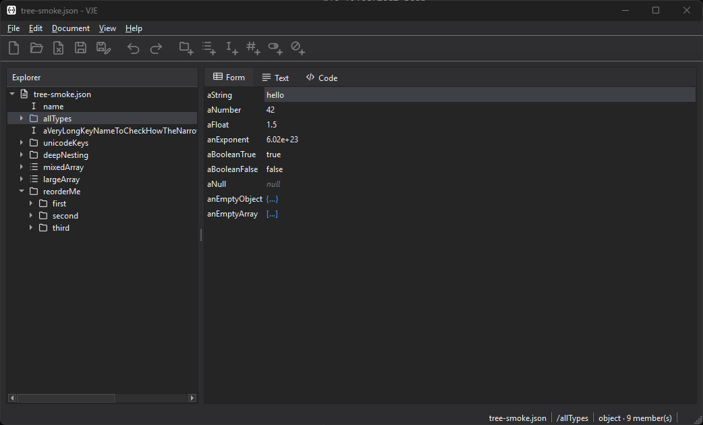

# VJE — Versatile JSON Editor
> *Version 2.0 — in development*


<p align="center">
  
</p>


## 📑 Table of Contents

- [✨ What It Does](#-what-it-does)
- [🚦 Project Status](#-project-status)
- [🚀 Quickstart](#-quickstart)
- [🔨 Build](#-build)
- [📂 Repository Structure](#-repository-structure)
- [⚙️ Technical Details](#-technical-details)
- [📄 License](#-license)

<br>

## ✨ What It Does

Most JSON editors hand you a wall of text and leave the structure for you to hold in your head. VJE presents a document the way you actually think about it — as a **navigable tree of nodes** on the left, paired with a **tabbed editor** on the right that shows the selected node through whichever lens suits the moment.

- **Explorer tree** — the whole document as a lazily-populated tree, each node carrying a type glyph, with expand/collapse, per-subtree commands, and keyboard navigation. Expansion and selection are restored by JSON Pointer across an edit, so the view does not jump out from under you.
- **Form View** — an object renders as a labelled key/value form; an array renders as a spreadsheet-like table; a scalar presents its parent with the field indicated. Keys rename in place and values edit in place, both columns reachable from the keyboard.
- **Text View** — a read-only, format-configurable rendering: eight table styles (Academic, Compact, Columnar, Spreadsheet, Minimal, Markdown, CSV, TSV), a Markdown list form, and an aligned key/value listing.
- **Code View** — the raw JSON, syntax-highlighted, with a line-number gutter, current-line marker, and block indent/outdent. Tree navigation keeps working *during* an uncommitted edit, and an invalid buffer cannot be committed.
- **Light and dark theming** — Light, Dark, or follow the OS, with a Fluent-like look. Icons are tinted from the palette at load time, so the entire 39-glyph set recolours with the theme rather than shipping two copies.

Under the surface, `vje_core` already implements considerably more than the UI currently exposes: order-preserving and number-token-preserving document model, full undo/redo, RFC 8259 validation, search and go-to-pointer, and CSV / XML / YAML conversion. Those land in the interface over the phases below.

<br>

## 🚦 Project Status

**VJE 2.0 is under active development and is not yet ready for general use.** It builds clean and passes its full test suite on both Windows and Linux, but the application's command surface is still being wired up phase by phase — see the Quickstart, which reflects what actually works today rather than what the menus imply.

| Area | State |
|------|-------|
| Domain library (`vje_core`) — model, undo, services, converters | ✅ Complete, headlessly tested |
| Application shell, theming, settings, icons | ✅ Complete |
| Explorer tree pane | ✅ Complete |
| Editor pane — Form, Text, and Code views | ✅ Complete |
| Commands, shortcuts, clipboard, provisional rows | ⏳ Next |
| File lifecycle — open, save, import/export, print | ⏳ Planned |
| Find, go-to, Settings dialog, packaging | ⏳ Planned |

Menu and toolbar commands owned by a later phase are **present but disabled** rather than hidden, so the shape of the finished application is visible while it is being assembled.

VJE 2.0 is a from-scratch rewrite of VJE 1.0 (C# / WinUI 3) onto a cross-platform native stack. The business logic carries over; the technology and architecture are new.

<br>

## 🚀 Quickstart

There is **no binary release yet** — build from source (see [Build](#-build) below), then run the executable from the build tree.

**Load a document by passing it on the command line.** File ▸ Open is one of the deferred commands above and is currently disabled, so the command line is the only way in for now:

```bat
build\windows-release\src\vje_app\vje_app.exe path\to\document.json
```

```bash
build/linux-release/src/vje_app/vje_app path/to/document.json
```

Launched with no argument, VJE opens empty — the shell, menus, and theming are all live, but the panes have nothing to show. A sample document ships at `assets/sample-files/tree-smoke.json`: it is the one in the screenshot above, and it exercises every JSON type, deep nesting, unicode keys, and a large array.

Once a document is loaded, click or arrow through the Explorer tree and the editor pane follows. Switch between **Form**, **Text**, and **Code** with the tabs, or <kbd>Tab</kbd> to move focus between the two panes. **View ▸ Theme** switches between Light, Dark, and System, and **View ▸ Expand All / Collapse All** work on the tree.

<br>

## 🔨 Build

Requires **CMake 3.21+**, **Ninja**, **GCC 13 or later**, and **Qt 6** — including the **Qt SVG** module, which is a hard dependency (the icon set is rasterized from SVG at load time). Both platforms build the same source tree with the same compiler family; there is no per-OS source split.

**On Windows**, GCC comes from MinGW-w64 and must match the Qt MinGW build you install. **On Linux**, GCC 13 comes from your distribution's toolchain packages, and Qt 6 from either your package manager or `aqtinstall`.

Configure, build, and test through the presets in `CMakePresets.json`:

```bash
cmake --preset linux-release
cmake --build --preset linux-release
ctest --preset linux-release --output-on-failure
```

Substitute `windows-debug`, `windows-release`, or `linux-debug` as needed. Each preset builds into `build/<preset-name>/`, and the application lands at `build/<preset-name>/src/vje_app/vje_app`.

The build is **warnings-as-errors** on both platforms, and the test suite is **41 CTest suites** covering the domain library headlessly and the widget layer offscreen. The GitHub Actions workflow runs the same presets across a Windows (MinGW GCC 13.1 / Qt 6.8.3) and Linux (GCC 13 / Qt 6.8.3) matrix on every push.

`yaml-cpp` is the only external dependency and is fetched automatically by CMake — nothing to install. YAML support can be turned off with `-DVJE_ENABLE_YAML=OFF`, and the tests with `-DVJE_BUILD_TESTS=OFF`.

<br>

## 📂 Repository Structure

```
vje/
├─ src/
│  ├─ vje_core/         UI-free domain library (Qt Core + Gui only, no Widgets)
│  │  ├─ document/      JsonNode DOM, JsonPointer (RFC 6901), JsonDocument
│  │  ├─ editing/       Edit commands over QUndoStack, UndoController
│  │  ├─ services/      Lexer, parser, serializer, formatter, I/O, search, validation
│  │  ├─ convert/       CSV, XML, and YAML codecs
│  │  └─ tests/         Headless Qt Test suites
│  │
│  └─ vje_app/          Qt Widgets application
│     ├─ models/        Tree, form, and table QAbstractItemModels
│     ├─ views/         Tree pane, editor pane, Form / Text / Code views
│     ├─ services/      Settings, theming, selection, status, icons
│     ├─ style/         Fluent metrics, focus highlighting, tone and palettes
│     └─ tests/         Offscreen Qt Test suites
│
├─ assets/
│  ├─ images/           Application icon, the 39-glyph icon set, screenshots
│  └─ sample-files/     JSON and XML documents used by the manual smoke tests
│
├─ cmake/               CMake modules (external dependency acquisition)
├─ .github/             GitHub Actions CI (Windows + Linux build and test matrix)
├─ CMakeLists.txt       Top-level build
├─ CMakePresets.json    Per-toolchain configure / build / test presets
├─ README.md
└─ LICENSE
```

## ⚙️ Technical Details

- **Language:** C++20.
- **UI framework:** Qt 6 Widgets, over the Fusion style with a Fluent-like metrics proxy.
- **Build system:** CMake + Ninja, driven by presets.
- **Compiler:** GCC 13+ on **both** platforms — MinGW-w64 on Windows, the distribution toolchain on Linux.
- **Testing:** Qt Test + CTest. `vje_core` is tested headlessly under a `QCoreApplication`; the widget layer is tested on the offscreen platform plugin.
- **Two-target split:** `vje_core` holds the entire domain — model, editing, services, converters — and links **no Qt Widgets**, which is what keeps it headlessly testable. `vje_app` is the UI on top of it.
- **Document model:** a custom `JsonNode` DOM that preserves both **member insertion order** and **raw number tokens**, so a load-edit-save round trip changes only what you changed. Duplicate object keys are accepted on load and preserved; new duplicates are rejected on edit.
- **Undo:** `QUndoStack` / `QUndoCommand`, with commands targeting nodes by JSON Pointer and re-resolving on every redo and undo.
- **Incremental models:** the tree and table models maintain a shadow projection and **diff** it against the document on each change — emitting exact row insert / remove / move and cell-change signals rather than resetting the view, which is what preserves expansion, selection, and scroll position across an edit.
- **Cross-platform strategy:** one source tree, no `windows/` / `linux/` split. Platform differences are handled in CMake and a small isolated `platform/` layer.

<br>

## 📄 License

Released under the [MIT License](LICENSE) — Copyright © 2026 Rohin Gosling.
