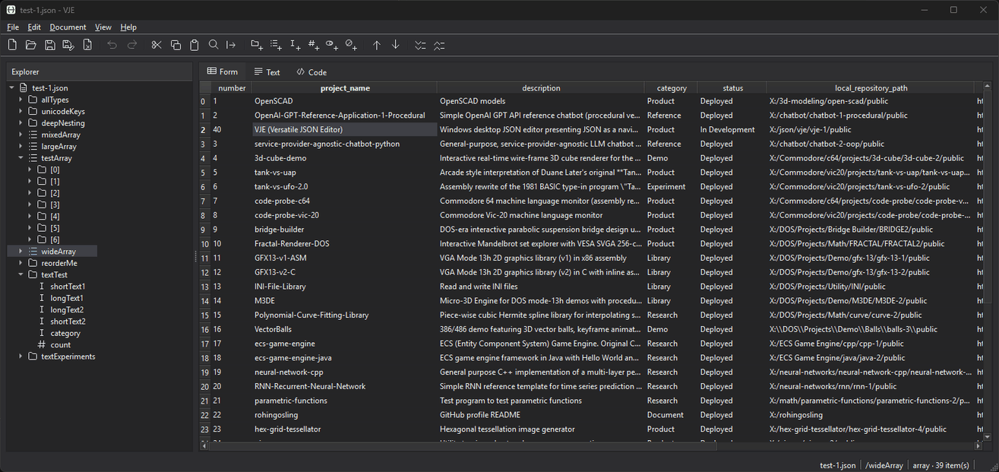

# VJE (Versatile JSON Editor)
> *Version 2.0 — In development*


<p align="center">
  
</p>


## 📑 Table of Contents

- [✨ What It Does](#-what-it-does)
- [🚦 Project Status](#-project-status)
- [🚀 Quickstart](#-quickstart)
- [🔨 Build](#-build)
- [📂 Repository Structure](#-repository-structure)
- [⚙️ Technical Details](#-technical-details)
- [📄 License](#-license)

<br>

## ✨ What It Does

Many JSON editors hand you a wall of context-unaware data and leave the structure for you to hold in your head. VJE presents JSON as an outlined document, the way you actually think about it. VJE presents JSON to you in a way that feels like the application was built specifically for your data, rather than a generic data dump.

VJE is great for navigating and editing configuration files, and works really well as a pseudo database for storing and navigating hierarchically arranged information.

### Features

- **Import, Export, and Conversion**
  - Import from XML, YAML, and CSV.
  - Export to XML, YAML, and CSV.
  - Convert JSON objects to arrays.
  - Convert JSON arrays to objects.
  - Convert between JSON data types, string, number, boolean, and null.

- **Explorer tree**
  - The tree view explorer surfaces JSON in the style of a document outline.  
  
- **Form View**
  - JSON objects are surfaced in the format of a master-detail form, offering a dedicated application-like user experience.  
  - JSON arrays are surfaced as editable spreadsheet-like tables. Both homogenous and jagged arrays are supported with all the tools you need to manipulate, normalize, and convert between various array structures.

- **Text View**
  - A read-only, format-configurable, text rendering of the data, making it super easy to copy and paste formatted text representations of JSON data into other documents.
  - Eight table styles (Academic, Compact, Columnar, Spreadsheet, Minimal, Markdown, CSV, TSV).
  - A Markdown list form, and an aligned key/value listing.

- **Code View**
  - JSON code editor, for when you just need to see and edit the code.
  - Syntax-highlighted, with a line-number gutter, current-line marker, and block indent/outdent.
  - Tree navigation keeps working *during* an uncommitted edit, and an invalid buffer cannot be committed.

- **Intuitive, Context-Aware Editing**
  - Add, rename, duplicate, delete, reorder, and convert between containers, from the menu bar, the toolbar, or a context menu.
  - Cut, copy, or paste of whole nodes and of individual table cells, inter-operating with external editors.

- **Finding your way around**    
  - `Goto` takes a JSON Pointer (e.g. `/projects/0/name`) and jumps straight there.
  - Copy JSON Pointer puts the selected node's path on the clipboard in exactly that form, so you can wander off, do other work, and paste your way back.

- **Files**
  - Import and export CSV, YAML, and XML.
  - Multiple XML import interpretation algorithms to chose from.

- **Target OS**
  - Windows
  - Linux
  - macOS (Coming soon)

### Planned

Ideas for a later release. These are **not** part of 2.0 — nothing below is implemented, and none of it is scheduled yet.

- **Analysis**
  - JSONPath query editor.
  - Mind map.
  - Histogram.

<br>

## 🚦 Project Status

- **VJE** 2.0 is under active development and is not yet ready for general use.
- **VJE** 1.x, along with their predecessor **Treepad**, have been depreciated.

<br>

## 🚀 Quickstart

There is **no binary release yet** — build from source (see [Build](#-build) below), then run the executable from the build tree.

**Open a document** with **File ▸ Open**, by dropping a file onto the window, or by passing a path on the command line:

### Windows
```bat
build\windows-release\src\vje_app\vje_app.exe path\to\document.json
```

### Linux
```bash
build/linux-release/src/vje_app/vje_app path/to/document.json
```

A sample document ships with the source at **`assets/sample-files/smoke-test-1.json`** — every JSON type, unicode and emoji keys, ten levels of nesting, mixed-kind and ragged arrays, and a 2,000-element array to open the tree on something worth navigating.

<br>

## 🔨 Build

Requires **CMake 3.21+**, **Ninja**, **GCC 13 or later**, and **Qt 6**, including the **Qt SVG** module, which is a hard dependency (the icon set ships in both vector and raster form, and the test suite rasterizes the vector one to check the two against each other). Both platforms build the same source tree with the same compiler family; there is no per-OS source split.

**On Windows**, GCC comes from MinGW-w64 and must match the Qt MinGW build you install. **On Linux**, GCC 13 comes from your distribution's toolchain packages, and Qt 6 from either your package manager or `aqtinstall`.

Configure, build, and test through the presets in `CMakePresets.json`:

```bash
cmake --preset linux-release
cmake --build --preset linux-release
ctest --preset linux-release --output-on-failure
```

Substitute `windows-debug`, `windows-release`, or `linux-debug` as needed. Each preset builds into `build/<preset-name>/`, and the application lands at `build/<preset-name>/src/vje_app/vje_app`.

The build is **warnings-as-errors** on both platforms, and the test suite is **54 CTest suites** covering the domain library headlessly and the widget layer offscreen. The GitHub Actions workflow runs the same presets across a Windows (MinGW GCC 13.1 / Qt 6.8.3) and Linux (GCC 13 / Qt 6.8.3) matrix on every push.

`yaml-cpp` is the only external dependency and is fetched automatically by CMake — nothing to install. YAML support can be turned off with `-DVJE_ENABLE_YAML=OFF`, and the tests with `-DVJE_BUILD_TESTS=OFF`.

<br>

## 📂 Repository Structure

```
vje/
├─ src/
│  ├─ vje_core/         UI-free domain library (Qt Core + Gui only, no Widgets)
│  │  ├─ document/      JsonNode DOM, JsonPointer (RFC 6901), JsonDocument
│  │  ├─ editing/       Edit commands over QUndoStack, UndoController
│  │  ├─ services/      Lexer, parser, serializer, formatter, I/O, search, validation
│  │  ├─ convert/       CSV, XML, and YAML codecs
│  │  └─ tests/         Headless Qt Test suites
│  │
│  └─ vje_app/          Qt Widgets application
│     ├─ models/        Tree, form, and table QAbstractItemModels
│     ├─ views/         Tree pane, editor pane, Form / Text / Code views
│     ├─ controllers/   File lifecycle, the import / export converter table, find and go-to, printing
│     ├─ dialogs/       Settings, Go To, and XML import dialogs
│     ├─ services/      Settings, theming, selection, status, icons, dialogs, I/O
│     ├─ printing/      What a view hands the printer, and how that becomes a page
│     ├─ style/         Fluent metrics, focus highlighting, tone and palettes
│     └─ tests/         Offscreen Qt Test suites
│
├─ assets/
│  ├─ images/           Application icon, the 43-glyph icon set (one master per size), screenshots
│  └─ sample-files/     JSON and XML documents used by the manual smoke tests
│
├─ cmake/               CMake modules (external dependency acquisition)
├─ .github/             GitHub Actions CI (Windows + Linux build and test matrix)
├─ CMakeLists.txt       Top-level build
├─ CMakePresets.json    Per-toolchain configure / build / test presets
├─ README.md
└─ LICENSE
```

## ⚙️ Technical Details

- **Language:** – C++20.

- **UI framework:** – Qt 6 Widgets, over the Fusion style with a Fluent-like metrics proxy.

- **Build system:** – CMake + Ninja, driven by presets.

- **Compiler:** – GCC 13+ on **both** platforms. MinGW-w64 on Windows, the distribution toolchain on Linux.

- **Testing:** – Qt Test + CTest. `vje_core` is tested headlessly under a `QCoreApplication`. The widget layer is tested on the offscreen platform plugin.

- **Two-target split:** – `vje_core` holds the entire domain, model, editing, services, converters, and links **no Qt Widgets**, which is what keeps it headlessly testable. `vje_app` is the UI on top of it.

- **Document model:** – A custom `JsonNode` DOM that preserves both **member insertion order** and **raw number tokens**, so a load-edit-save round trip changes only what you changed. Duplicate object keys are accepted on load and preserved; new duplicates are rejected on edit.

- **Undo:** – `QUndoStack` / `QUndoCommand`, with commands targeting nodes by JSON Pointer and re-resolving on every redo and undo.

- **Cross-platform strategy:** – One source tree, no `windows/` / `linux/` split. Platform differences are handled in CMake and a small isolated `platform/` layer.

<br>

## 📄 License

Released under the [MIT License](LICENSE) — Copyright © 2024 Rohin Gosling.
