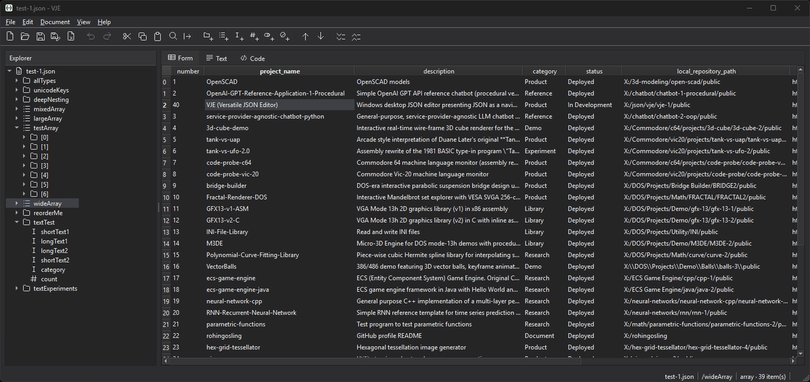

<p align="center"></p>

# VJE (Versatile JSON Editor)
> *Version 2.0 (Pre-Alpha) – In development*


<p align="center">
  
</p>


## 📑 Table of Contents

- [✨ What It Does](#-what-it-does)
- [🚦 Project Status](#-project-status)
- [🚀 Quickstart](#-quickstart)
- [🔨 Build](#-build)
- [📂 Repository Structure](#-repository-structure)
- [⚙️ Technical Details](#-technical-details)
- [📄 License](#-license)

<br>

## ✨ What It Does

Many JSON editors hand you a wall of context-unaware data and leave the structure for you to hold in your head. VJE presents JSON as an outlined document, the way you actually think about it. VJE presents JSON to you in a way that feels like the application was built specifically for your data, rather than a generic data dump.

VJE is great for navigating and editing configuration files, and works really well as a pseudo database for storing and navigating hierarchically arranged information.

### Features

- **Import, Export, and Conversion**
  - Import from XML, YAML, and CSV.
  - Export to XML, YAML, and CSV.
  - Convert JSON objects to arrays.
  - Convert JSON arrays to objects.
  - Convert between JSON data types, string, number, boolean, and null.

- **Explorer tree**
  - The tree view explorer surfaces JSON in the style of a document outline.  
  
- **Form View**
  - JSON objects are surfaced in the format of a master-detail form, offering a dedicated application-like user experience.  
  - JSON arrays are surfaced as editable spreadsheet-like tables. Both homogenous and jagged arrays are supported with all the tools you need to manipulate, normalize, and convert between various array structures.

- **Text View**
  - A read-only, format-configurable, text rendering of the data, making it super easy to copy and paste formatted text representations of JSON data into other documents.
  - Eight table styles (Academic, Compact, Columnar, Spreadsheet, Minimal, Markdown, CSV, TSV).
  - A Markdown list form, and an aligned key/value listing.

- **Code View**
  - JSON code editor, for when you just need to see and edit the code.
  - Syntax-highlighted, with a line-number gutter, current-line marker, and block indent/outdent.
  - Tree navigation keeps working *during* an uncommitted edit, and an invalid buffer cannot be committed.

- **JSONPath Query View**
  - Ask the whole document a question, and get back a list of results you can click.
  - Root, child by name, index, slice, wildcard, recursive descent, union, and filter expressions, the accepted grammar is stated exactly, and anything outside it is reported with its position rather than silently ignored.
  - Every result is a JSON Pointer: choose one and the tree selects and reveals that node, expanding a collapsed branch to get to it.
  - Open it from the View menu; close it, like any other tab, when you are done.

- **Intuitive, Context-Aware Editing**
  - Add, rename, duplicate, delete, reorder, and convert between containers, from the menu bar, the toolbar, or a context menu.
  - Cut, copy, or paste of whole nodes and of individual table cells, inter-operating with external editors.
  - Whole **rows and columns** too: click a column header or a row index to select it, then cut, copy, paste or delete it. A copied column can be pasted anywhere, onto another column, into an array, or into an object, and what it becomes is decided by what it lands on.

- **Finding your way around**    
  - `Goto` takes a JSON Pointer (e.g. `/projects/0/name`) and jumps straight there.
  - Copy JSON Pointer puts the selected node's path on the clipboard in exactly that form, so you can wander off, do other work, and paste your way back.

- **Files**
  - Import and export CSV, YAML, and XML.
  - Multiple XML import interpretation algorithms to chose from.

- **Look and feel**
  - Light, Dark, and System themes.
  - Two interface styles, **Fluent** and **Classic**, each with its own icon family, switchable without a restart.

- **Target OS**
  - Windows, with optional Explorer integration: **Open with ▸ VJE** and **Edit in VJE** on a `.json` file's context menu, switched on in Settings ▸ System. Per user, and VJE never makes itself the default application.
  - Linux (file-manager integration is planned for a later release)
  - macOS (Coming soon)

### Planned

Ideas for a later release. These are **not** part of 2.0. Nothing below is implemented, and none of it is scheduled yet.

- **Analysis**
  - JSONPath query editor.
  - Mind map.
  - Histogram.

<br>

## 🚦 Project Status

- **VJE** 2.0 is under active development and is not yet ready for general use.
- **VJE** 1.x, along with their predecessor **Treepad**, have been depreciated.

<br>

## 🚀 Quickstart

There is **no binary release yet**. Build from source (see [Build](#-build) below), then run the executable from the build tree.

**Open a document** with **File ▸ Open**, by dropping a file onto the window, or by passing a path on the command line:

### Windows
```bat
build\windows-release\bin\vje path\to\document.json
```

### Linux
```bash
build/linux-release/bin/vje path/to/document.json
```

### Command line

A few commands run **without a window**, so they work in a script, in CI and over SSH:

```bash
vje --validate a.json b.json          # One line per file: "valid", or file:line:column: error: ...
vje --query '$..id' data.json         # Each match as a JSON Pointer, one per line
vje --query '$..id' --values -        # Each match's value as compact JSON, reading standard input
vje --register-explorer-integration   # Windows: add VJE to Explorer's menus for .json files
vje --help                            # The full usage, including the exit codes
```

Exit codes follow `grep`: **0** yes, **1** no (a file is invalid, or the query matched nothing), **2** a usage error, **3** a file that could not be read, or Explorer entries that could not be written. On Windows, typing `vje` in a terminal runs `vje.com`, a console twin of the window program `vje.exe`, so a terminal gets real output while Explorer and shortcuts never open a console window.

A sample document ships with the source at **`assets/sample-files/smoke-test-1.json`**, and it is the fastest way to see what VJE does. It opens on ordinary data, an application config, the eight planets as a table, twenty sensor readings, and then works down through the awkward cases: every JSON type, every string escape, unicode and emoji in both values *and* keys, number tokens that must survive a round trip unchanged, ragged and mixed-kind arrays, RFC 6901's own JSON Pointer test keys, duplicate sibling keys, ten levels of nesting, and a 2,000-element array to open the tree on something worth navigating. Every section carries a `_note` saying what it is there to show. Nothing in it is loaded by the application, so it is safe to edit freely.

<br>

## 🔨 Build

Requires **CMake 3.21+**, **Ninja**, **GCC 13 or later**, and **Qt 6**, including the **Qt SVG** module, which is a hard dependency (the Fluent icon family is vector, and the test suite rasterizes it to check it against the artwork it was traced from). Both platforms build the same source tree with the same compiler family; there is no per-OS source split.

**On Windows**, GCC comes from MinGW-w64 and must match the Qt MinGW build you install. **On Linux**, GCC 13 comes from your distribution's toolchain packages, and Qt 6 from either your package manager or `aqtinstall`.

Configure, build, and test through the presets in `CMakePresets.json`:

```bash
cmake --preset linux-release
cmake --build --preset linux-release
ctest --preset linux-release --output-on-failure
```

Substitute `windows-debug`, `windows-release`, or `linux-debug` as needed. Each preset builds into `build/<preset-name>/`, and the application lands in `build/<preset-name>/bin/`: `vje` on Linux, and on Windows the pair `vje.exe` (the window program Explorer and shortcuts launch) and `vje.com` (its console twin, which a terminal runs when you type `vje`).

The build is **warnings-as-errors** on both platforms, and the test suite is **78 CTest suites** (77 on Linux, where the Windows registry suite is not built) covering the domain library headlessly and the widget layer offscreen. The GitHub Actions workflow runs the same presets across a Windows (MinGW GCC 13.1 / Qt 6.8.3) and Linux (GCC 13 / Qt 6.8.3) matrix on every push.

`yaml-cpp` is the only external dependency and is fetched automatically by CMake, nothing to install. YAML support can be turned off with `-DVJE_ENABLE_YAML=OFF`, and the tests with `-DVJE_BUILD_TESTS=OFF`.

<br>

## 📂 Repository Structure

```
vje/
├─ src/
│  ├─ vje_core/          UI-free domain library (Qt Core + Gui only, no Widgets)
│  │  ├─ document/       JsonNode DOM, JsonPointer (RFC 6901), JsonDocument
│  │  ├─ editing/        Edit commands over QUndoStack, UndoController
│  │  ├─ services/       Lexer, parser, serializer, formatter, I/O, search, validation
│  │  ├─ convert/        CSV, XML, and YAML codecs
│  │  └─ tests/          Headless Qt Test suites
│  │
│  ├─ vje_settings/      The settings store, shared by the window and the command line
│  │
│  ├─ vje_cli/           The command line: one definition, the launch plan, --validate / --query (no Widgets)
│  │  ├─ commands/       Help, version, validate, query, and the Windows Explorer pair
│  │  └─ tests/          Headless suites, and runs of the built executables
│  │
│  ├─ platform/          The isolated per-OS layer: console output, Unicode arguments, Explorer integration
│  ├─ vje_app/           Qt Widgets application (vje.exe on Windows, vje on Linux)
│  │  ├─ models/         Tree, form, and table QAbstractItemModels
│  │  ├─ views/          Tree pane, editor pane, Form / Text / Code / JSONPath views
│  │  ├─ controllers/    File lifecycle, the import / export converter table, find and go-to, printing
│  │  ├─ dialogs/        Settings, Go To, and XML import dialogs
│  │  ├─ services/       Settings, theming, selection, status, icons, dialogs, I/O
│  │  ├─ printing/       What a view hands the printer, and how that becomes a page
│  │  ├─ style/          Fluent metrics, focus highlighting, tone and palettes
│  │  └─ tests/          Offscreen Qt Test suites
│  │
│  └─ vje_console/       Windows only: vje.com, the console twin a terminal runs as `vje`
│
├─ assets/
│  ├─ images/            Application icon, the two 47-glyph icon families, screenshots
│  └─ sample-files/      JSON and XML documents used by the manual smoke tests
│
├─ cmake/                CMake modules (external dependency acquisition)
├─ .github/              GitHub Actions CI (Windows + Linux build and test matrix)
├─ CMakeLists.txt        Top-level build
├─ CMakePresets.json     Per-toolchain configure / build / test presets
├─ README.md
└─ LICENSE
```

## ⚙️ Technical Details

- **Language:** C++20.

- **UI framework:** Qt 6 Widgets, over the Fusion style with a Fluent-like metrics proxy.

- **Build system:** CMake + Ninja, driven by presets.

- **Compiler:** GCC 13+ on **both** platforms. MinGW-w64 on Windows, the distribution toolchain on Linux.

- **Testing:** Qt Test + CTest. `vje_core` is tested headlessly under a `QCoreApplication`. The widget layer is tested on the offscreen platform plugin.

- **Layered targets:** `vje_core` holds the entire domain, model, editing, services, converters, and links **no Qt Widgets**, which is what keeps it headlessly testable. `vje_cli` is the command line over it, also without Widgets, so the no-window commands need no display. `vje_app` is the UI on top of both.

- **Document model:** A custom `JsonNode` DOM that preserves both **member insertion order** and **raw number tokens**, so a load-edit-save round trip changes only what you changed. Duplicate object keys are accepted on load and preserved; new duplicates are rejected on edit.

- **Undo:** `QUndoStack` / `QUndoCommand`, with commands targeting nodes by JSON Pointer and re-resolving on every redo and undo.

- **Cross-platform strategy:** One source tree, no `windows/` / `linux/` split. Platform differences are handled in CMake and a small isolated `platform/` layer.

<br>

## 📄 License

Released under the [MIT License](LICENSE) - Copyright © 2024 Rohin Gosling.

### Third-party assets

VJE ships two icon families, selected by **Settings ▸ Appearance ▸ Interface style**. The **Classic** family and the application icon are the project's own hand-drawn artwork. The **Fluent** family is part vendored and part original: 32 of its 47 glyphs come from Microsoft's [Fluent System Icons](https://github.com/microsoft/fluentui-system-icons), © 2020 Microsoft Corporation, used under the MIT licence, the notice travels with them at [`assets/images/icons/fluent/microsoft/LICENSE`](assets/images/icons/fluent/microsoft/LICENSE), and `icon-map.json` beside it records which glyph came from which upstream family. The remaining 15 are VJE's own, for concepts Fluent has no equivalent of.
